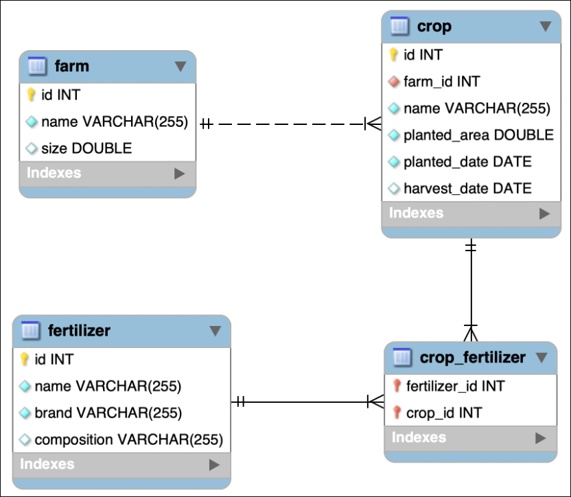

# Boas vindas ao repositório do meu projeto final Agrix!

O Agrix é um sistema de gestão e monitoramento de fazendas.

# Resumo

Essa é uma plicação spring boot que desenvolvi ao final dos meus estudos na [Trybe](https://www.betrybe.com).
A aplicação possui as funcionalidades básicas de criar, ler, atualiazar e deletar dados relacionados a fazendas, plantações e fertilizantes e tudo com base no ambiente spring, usando Spring Data JPA, Spring Web, Spring Security e o Spring Boot.

#🚀 Tecnologias utilizadas
---
 Java   Spring Boot   Spring Web   Spring Data JPA   Spring Security MySQL

---
<details>
  <summary>📊 Diagrama Relacional de Entidades</summary>
  
  

</details>

---
# 🖥️ Iniciando aplicação
• Para copiar o repositório para uma pasta local, use o seguinte comando no terminal:

```bash
git@github.com:Gustavo-GPG/ProjetoFinalAngrix.git
```
Caso você não tenha o Git instalado, você pode instalá-lo usando os seguintes comandos, dependendo do seu sistema operacional:

Debian/Ubuntu (Terminal Bash):
```bash
sudo apt-get install git
```
Windows (PowerShell):
```bash
winget install --id Git.Git -e --source winget
```
Ou você pode seguir a documentação do site [git](https://git-scm.com/downloads) para mais meios de instalação.

• Navegue até a raiz da pasta criada no clone, abra o terminal e digite o comando:
```bash
mvn install
```
• Navegue até \src\main\java\com\betrybe\agrix\AgrixApplication.java e rode a aplicação manualment ou com:
```bash
mvn spring-boot:run
```

⚠️**Atenção:** A aplicação usa por padrão a porta 8080 então certifique-se de tela disponível

# 📌 Requisições

🌾 Fazendas

• Criar uma fazenda

POST /farms

📥 Exemplo de requisição:
```
{
  "name": "Fazendinha",
  "size": 5
}
```

📤 Exemplo de resposta:
```
{
  "id": 1,
  "name": "Fazendinha",
  "size": 5
}
```

• Listar todas as fazendas

GET /farms

📤 Exemplo de requisição:
```
[
  {
    "id": 1,
    "name": "Fazendinha",
    "size": 5.0
  },
  {
    "id": 2,
    "name": "Fazenda do Júlio",
    "size": 2.5
  }
]
```

• Buscar uma fazenda pelo ID

GET /farms/{id}

📤 Exemplo de resposta para /farms/3:
```
{
  "id": 3,
  "name": "My Cabbages!",
  "size": 3.49
}
```

🌱 Plantações

• Adicionar uma plantação a uma fazenda

POST /farms/{farmId}/crops

📥 Exemplo de requisição para /farms/1/crops:
```
{
  "name": "Couve-flor",
  "plantedArea": 5.43
}
```
📤 Exemplo de resposta:
```
{
  "id": 1,
  "name": "Couve-flor",
  "plantedArea": 5.43,
  "farmId": 1
}
```

• Listar plantações de uma fazenda específica

GET /farms/{farmId}/crops

📤 Exemplo de resposta para /farms/1/crops:
```
[
  {
    "id": 1,
    "name": "Couve-flor",
    "plantedArea": 5.43,
    "farmId": 1
  },
  {
    "id": 2,
    "name": "Alface",
    "plantedArea": 21.3,
    "farmId": 1
  }
]
```

• Listar todas as plantações

GET /crops

📤 Exemplo de resposta:
```
[
  {
    "id": 1,
    "name": "Couve-flor",
    "plantedArea": 5.43,
    "farmId": 1
  },
  {
    "id": 2,
    "name": "Alface",
    "plantedArea": 21.3,
    "farmId": 1
  },
  {
    "id": 3,
    "name": "Tomate",
    "plantedArea": 1.9,
    "farmId": 2
  }
]
```

• Buscar uma plantação pelo ID

GET /crops/{id}

📤 Exemplo de resposta para /crops/3:
```
{
  "id": 3,
  "name": "Tomate",
  "plantedArea": 1.9,
  "farmId": 2
}
```


• Busca plantações com base em critérios específicos.

GET /crops/search

📤 Exemplo de resposta:
```
[
  {
    "id": 1,
    "name": "Couve-flor",
    "plantedArea": 5.43,
    "plantedDate": "2022-02-15",
    "harvestDate": "2023-02-20",
    "farmId": 1
  },
  {
    "id": 3,
    "name": "Tomate",
    "plantedArea": 1.9,
    "plantedDate": "2023-05-22",
    "harvestDate": "2024-01-10",
    "farmId": 2
  }
]
```

• Cadastra um novo fertilizante.

POST /fertilizers

📤 Exemplo de requisição:
```
{
  "name": "Compostagem",
  "brand": "Feita em casa",
  "composition": "Restos de alimentos"
}
```
📤 Exemplo de resposta:
```
{
  "id": 1,
  "name": "Compostagem",
  "brand": "Feita em casa",
  "composition": "Restos de alimentos"
}
```

• Lista todos os fertilizantes cadastrados.

GET /fertilizers

📤 Exemplo de resposta:
```
[
  {
    "id": 1,
    "name": "Compostagem",
    "brand": "Feita em casa",
    "composition": "Restos de alimentos"
  },
  {
    "id": 2,
    "name": "Húmus",
    "brand": "Feito pelas minhocas",
    "composition": "Muitos nutrientes"
  },
  {
    "id": 3,
    "name": "Adubo",
    "brand": "Feito pelas vaquinhas",
    "composition": "Esterco"
  }
]
```

• Obtém detalhes de um fertilizante específico pelo ID.

GET /fertilizers/{id}

📤 Exemplo de resposta:
```
{
  "id": 3,
  "name": "Adubo",
  "brand": "Feito pelas vaquinhas",
  "composition": "Esterco"
}
```

• Associa um fertilizante a uma plantação.

POST /crops/{cropId}/fertilizers/{fertilizerId}

📤 Exemplo de resposta:
```
Fertilizante e plantação associados com sucesso!
```

• Lista os fertilizantes associados a uma plantação.

GET /crops/{cropId}/fertilizers

📤 Exemplo de resposta:
```
[
  {
    "id": 2,
    "name": "Húmus",
    "brand": "Feito pelas minhocas",
    "composition": "Muitos nutrientes"
  },
  {
    "id": 3,
    "name": "Adubo",
    "brand": "Feito pelas vaquinhas",
    "composition": "Esterco"
  }
]
```

• Salvar novas pessoas no banco de dados:

POST /persons

📤 Exemplo de requisição:
```
{
  "username": "zerocool",
  "password": "senhasecreta",
  "role": "ADMIN"
}
```
📤 Exemplo de resposta:
```
{
  "id": 1,
  "username": "zerocool",
  "role": "ADMIN"
}
```
---

Este projeto foi guiado por requisitos pré-estabelecidos pela [Trybe](https://www.betrybe.com).
